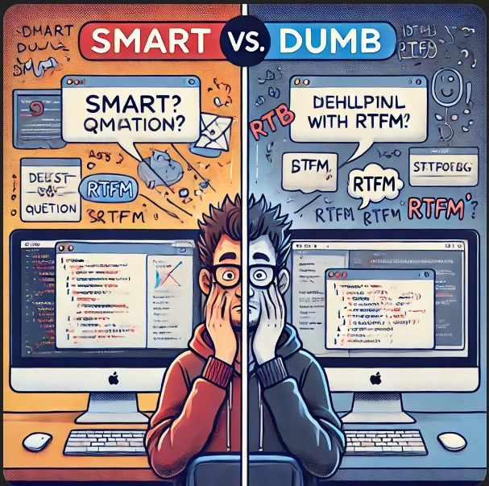

## The Importance of Asking Smart Questions in Software Engineering

Effective communication is the bedrock of successful software engineering. When you ask clear, concise, and well-thought-out questions, you’re not just solving your own problem—you’re contributing to a culture of collaboration that benefits everyone. Eric Raymond’s *How to Ask Questions the Smart Way* lays out the blueprint for asking questions that are specific, well-researched, and, most importantly, respectful of the respondent’s time.

Now, let’s dive into the difference a smart question can make!

## Example of a Smart Question

Let’s take a look at this shining example from StackOverflow:

**Title:** *Why does using float instead of int give me different results when all of my inputs are integers?*

### Question Body:
> I’m working on some calculations in C# where all of my inputs are integers. However, when I switch my variables to `float`, the results don’t match up with what I expect. Here’s a simplified version of my code:
> ```csharp
> int a = 5;
> int b = 2;
> float result = a / b;
> Console.WriteLine(result); // Outputs 2.0
> ```
> When I change `result` to `float`, the output changes to 2.5. Can anyone explain why this happens, and how I can ensure consistent results?

### Analysis:
- **Clarity and Specificity:** The question is crystal clear. The asker lays out the issue and provides a minimal, reproducible example—making it easy for others to diagnose.
- **Effort Demonstrated:** The user shows they’ve made an effort by sharing their code and explaining the behavior they’re seeing, which helps responders understand the context right away.
- **Respect for Respondents:** The question is straightforward and concise, acknowledging that time is valuable.

**Link to StackOverflow:** [Why does using float instead of int give me different results when all of my inputs are integers?](https://stackoverflow.com/questions/15118057/why-does-using-float-instead-of-int-give-me-different-results-when-all-of-my-inp)

### Community Response:
The community responds with detailed explanations, diving into C#’s behavior with integer division and how the `/` operator works with different data types. They also suggest type casting to achieve the desired result. This leads to a productive and efficient solution.

---

## Example of a Not So Smart Question

Let’s compare that to a question that misses the mark:

**Title:** *My program is broken. Help!*

### Question Body:
> I wrote some code, and it’s not working. I have no idea why. Can someone help me figure it out?

### Analysis:
- **Lack of Specificity:** The problem is extremely vague and there’s no context or example to go on.
- **No Demonstrated Effort:** No code is provided, and there’s no indication that the asker has tried to troubleshoot the issue on their own.
- **Disrespectful to Respondents:** The question is too broad and wastes responders' time by not offering enough information to work with.

**Link to StackOverflow:** [My program is broken. Help!](https://meta.stackoverflow.com/questions/281129/worst-voted-question-asked)

### Community Response:
The question likely gets downvoted due to its vagueness, leading to a series of unhelpful comments requesting more details. Without concrete examples or code, it’s nearly impossible for anyone to offer meaningful help, and the process becomes frustrating for everyone involved.

---

## Insights Gained

This exercise really brings home the importance of asking smart, well-researched questions. When you ask a good question, you’re not just asking for help, you’re also showing respect for the community, and you’re enabling people to help you more effectively. On the flip side, vague or lazy questions only create frustration and hinder the problem-solving process.

By following the principles Eric Raymond outlines, we can improve not just our technical skills but also our communication skills. The more thoughtful we are in asking questions, the better our chances are of fostering productive collaboration, whether we’re tackling problems alone or working with others.

So, the next time you’re about to ask a question, take a step back, ensure you’ve done your homework, and think about how you can structure it to make everyone’s life easier. Trust me, it’ll make all the difference.
