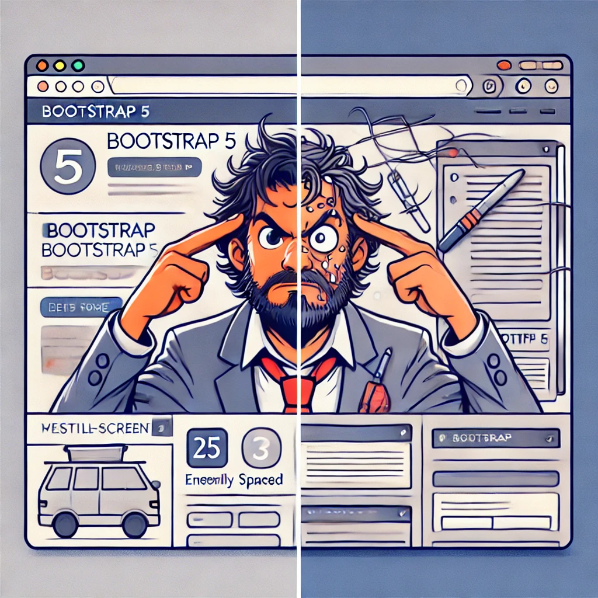

## UI Frameworks: A Blessing or a Bootstrap Trap?

UI frameworks promise a shortcut to professional looking web pages, but let's be real—they sometimes feel like deciphering an alien language. You trade writing endless CSS for deciphering a new syntax, and before you know it, you're knee-deep in Bootstrap 5 class names wondering if you made a mistake.

I’ve personally struggled with Bootstrap 5 when trying to customize layouts. Just when I thought I had it figured out, I’d realize a default margin or padding was ruining my entire layout. CSS overrides became a battle between my willpower and Bootstrap’s `!important` rules. But after enough trial and error (and a few moments of existential dread), I started to appreciate the efficiency Bootstrap brings.

But before you run screaming back to raw HTML and CSS, let’s break down why UI frameworks like Bootstrap 5 might actually be worth the headache.

---

## Why Not Just Use Raw HTML and CSS?

You **could** build everything from scratch—just like you **could** build your own furniture instead of buying IKEA. But unless you enjoy pain, UI frameworks help in three big ways:

1. **Efficiency** – Why reinvent the wheel when Bootstrap 5 hands you a fully functional grid system?
2. **Consistency** – Every button, card, and navbar matches like an overachieving yearbook committee.
3. **Mobile-Friendly By Default** – Bootstrap 5 ensures your site doesn't look like it was built in 1999 when viewed on a phone.

Of course, this convenience comes at a cost: class soup. If you've ever stared at `btn btn-lg btn-primary w-100`, you know the struggle is real.

---

## The Good, The Bad, and The Bootstrap

### The Good:
✅ **Responsive Grid** – Saves you from writing endless media queries.
✅ **Prebuilt Components** – Buttons, modals, and alerts, all styled and ready to go.
✅ **Huge Community** – Help is just a Stack Overflow thread away.

### The Bad:
❌ **Learning Curve** – Feels like learning a new language (except this one doesn’t impress at parties).
❌ **Customization Struggles** – Good luck overriding Bootstrap styles without an argument.
❌ **File Size Bloat** – Do you really need all that CSS for one button?

---

## Bootstrap 5 vs. Styling with CSS: The Showdown

Styling with raw CSS offers unlimited flexibility, but that freedom comes at a cost—time. Here’s a side-by-side comparison of solving the same problem with Bootstrap 5 versus pure CSS.

### **Centered Button - Bootstrap 5:**
```html
<button class="btn btn-primary d-block mx-auto">Click Me</button>
```

### **Centered Button - Pure CSS:**
```html
<button class="custom-button">Click Me</button>
```
```css
.custom-button {
  background-color: blue;
  color: white;
  padding: 10px 20px;
  border: none;
  display: block;
  margin: 0 auto;
  text-align: center;
}
```



With Bootstrap, it’s a single class (`mx-auto`). With CSS, you’re writing custom rules from scratch. Multiply that across a full project, and you can see why UI frameworks save time.

---

## So, Is It Worth the Pain?

Short answer: **Yes.**

Long answer: If you’re building web apps or client-facing websites, Bootstrap 5 is worth the investment. The learning curve might sting, but the time savings and responsiveness make it a solid choice. Just be prepared for some class-name headaches along the way.

But if you enjoy raw CSS and control over every pixel, stick with handcrafted styles. Either way, just don’t center a div using `margin: auto;` and expect a medal.

---

### Visual Comparison: UI Framework vs. Raw HTML/CSS

**Bootstrap 5 Version:**


**Raw HTML/CSS Version:**


---

## Conclusion

UI frameworks aren’t magic bullets, but they save time and frustration, eventually. Whether you love them or hate them, they’ve earned their place in web development. So, if Bootstrap 5 is giving you nightmares, just remember, It’s still better than writing `float: left;` and praying for the best.

Now, go forth and bootstrap responsibly.

