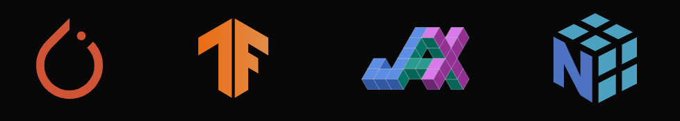

## The Complexity of Deep Learning Frameworks

Deep learning has always fascinated me. I remember my first encounter with TensorFlow and PyTorch – the sheer power and flexibility of these frameworks left me awe-struck. But with great power comes great complexity. Each framework has its own unique set of rules, quirks, and challenges. It's as though you need a different set of tools for every framework, making it difficult to seamlessly integrate them into a single project. This is where Ivy comes in.

## Enter Ivy: The Bridge Between Frameworks

Ivy is the glue that binds these disparate frameworks together. It provides a unified API, allowing developers to write code once and deploy it across multiple frameworks without modification. For me, Ivy is the bridge between the chaos of different ecosystems and the simplicity of unified development. It’s like discovering a new language that connects all the scattered dialects of deep learning.

## My Contribution to Ivy

As part of my journey into open-source development, I’ve had the chance to contribute to Ivy. One of my most meaningful contributions was enhancing the `take` function to ensure proper dispatching and compatibility across frameworks. It was a deep dive into how NumPy handles function dispatching and how to make it work smoothly with other array-like objects, such as Dask and CuPy. It was a challenge, but it helped me understand the heart of interoperability.

## Code as Art: Connecting the Dots

When I look at the work I’ve done, I think of it as part of a larger tapestry. Each line of code is a brushstroke, contributing to a bigger picture of AI development. My contribution is a small but essential piece of Ivy's goal to make deep learning more accessible, adaptable, and efficient. It’s exciting to be part of this journey, and I know this is just the beginning. There's much more to learn, and I can’t wait to see where this path will take me. The fire of curiosity keeps burning, and I’m ready to keep feeding it.
