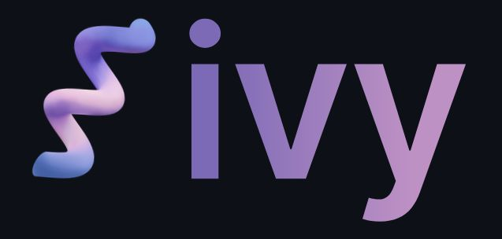

<div class="text-center p-4">
  
</div>

## The AI Framework Struggle (and How Ivy Fixes It)
If you've worked with AI, you know the headache; TensorFlow, PyTorch, JAX, and NumPy each have their own way of doing things. Switching between them is like translating between languages with no dictionary. That’s where Ivy comes in. It’s an open-source framework that lets you write your deep learning code once and run it on any of these frameworks, without the need to rewrite. Pretty cool, right?

## My First Steps into GitHub and Open Source
Before working on Ivy, I had no clue how open-source projects worked. To me, GitHub was this mysterious place where I could download software that I didn't know how to compile or install. Contributing to Ivy changed that. I got a chance to turn these terms into action:

- **Fetching:** Getting the latest code so I wasn’t working with outdated files.
- **Issues:** A public to-do list where anyone can report bugs or suggest improvements.
- **Pull Requests:** Proposing changes and getting feedback from maintainers before merging them.

These weren’t just GitHub jargon anymore. I was using them in a real project!

## Wrapping My Head Around `numpy.take`
My contribution? Implementing `numpy.take` in Ivy. If you’ve never used `take`, here’s the gist: it grabs elements from an array based on indices. 

### Example of `numpy.take` in Action
```python
import numpy as np

arr = np.array([10, 20, 30, 40, 50])
indices = [0, 2, 4]

result = np.take(arr, indices)
print(result)  # Output: [10 30 50]
```
Boom, just like that, we extract `[10, 30, 50]` from the array.

## Diving into My Contribution
I tackled Issue #5913 in Ivy, working on `take` to ensure it played nicely with NumPy’s function dispatching. Ivy needed `take` to support different backends like CuPy and Dask, so I had to make sure the implementation wasn’t just a straight NumPy copy-paste.

### The Magic Behind `take`
#### 1. Dispatching with `@array_function_dispatch(_take_dispatcher)`
This little decorator lets NumPy decide which version of `take` to use, depending on the array type.

#### 2. The `take` Function Itself
```python
def take(a, indices, axis=None, mode='raise'):
    return _wrapfunc(a, 'take', indices, axis=axis, mode=mode)
```
**Breaking it down:**
- `a`: The input array.
- `indices`: The positions of elements we want.
- `axis`: If specified, we extract elements along that axis.
- `mode`: How to handle out-of-bounds indices.

#### 3. Why This Matters
- Supports custom array-like objects (Dask, CuPy, etc.).
- Efficiently dispatches the right function for the job.
- Keeps things clean and reusable.

### Custom Array Example
Want proof? Here’s a custom class overriding `take`:
```python
import numpy as np

class CustomArray:
    def __init__(self, data):
        self.data = np.array(data)
    
    def take(self, indices, axis=None, mode='raise'):
        print("Custom take function called!")
        return self.data.take(indices, axis=axis, mode=mode)
    
    def __array_function__(self, func, types, args, kwargs):
        if func is np.take:
            return self.take(*args, **kwargs)
        return NotImplemented

# Using NumPy's `take`
arr = CustomArray([10, 20, 30, 40, 50])
indices = [0, 2, 4]

result = np.take(arr, indices)  
print(result)
```
**Output:**
```bash
Custom take function called!
[10 30 50]
```
NumPy recognized our custom class and routed the `take` call properly!

## What I Learned from This
- GitHub is way less intimidating once you start using it.
- Fetching, issues, and pull requests are the backbone of open-source collaboration.
- Ivy is doing something incredible by unifying AI frameworks.
- Function dispatching is powerful and lets libraries like NumPy stay flexible.

## Wrapping It Up
Contributing to Ivy wasn’t just about writing code—it was my introduction to real-world software collaboration. I got to dive into GitHub, understand open-source workflows, and contribute to something bigger than myself. Plus, knowing my work helps AI researchers and developers seamlessly switch between frameworks? That’s an awesome feeling.
